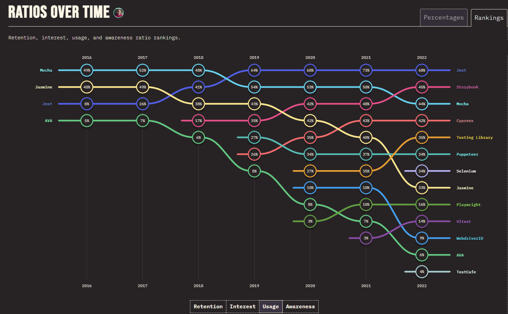
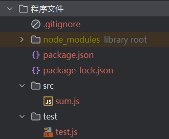
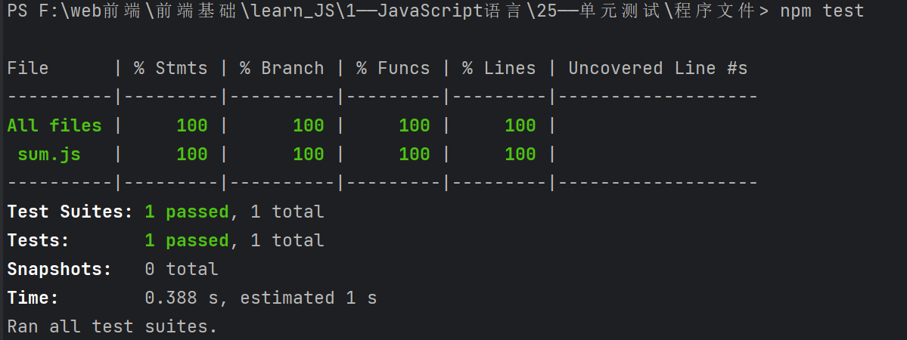

# 一，第一个单元测试

[前端测试框架使用调查](https://2022.stateofjs.com/en-US/libraries/testing/)：

我们打算使用老牌的 Jest，它历史较久，相对成熟，兼容性较高。

1，安装 Jest：
```bash
npm install --save-dev jest
```

2，在 package.json 中添加：
```javascript
{
  "scripts": {
    "test": "jest"
  },
  "jest": {
    "collectCoverage": true
  },
  "devDependencies": {
    ...
  }
}
```
- 添加了 jest 覆盖率配置，这样在执行测试时会自动输出覆盖率报告。

3，创建如下目录结构：

```javascript
sum.js：

/* jshint node: true */
function sum(a, b) {
  return a + b;
}
module.exports = sum;
```
```javascript
test.js:

/* jshint node: true */
var sum = require('../sum');

// Jest的test函数接受两个参数，第一个参数是字符串，表示测试的标题，第二个参数是一个函数，表示测试的内容。
test('1 + 2 = 3', () => {
  // Jest的expect函数接受一个值，配合toBe方法，判断这个值是否等于3。
  expect(sum(1, 2)).toBe(3);
});
```

我不太习惯使用 CommonJS 的 require，而更喜欢使用 ES6 模块 import/export 语法。
为了实现转换，需要额外安装ES6语法解析转换插件：
```bash
npm install --save-dev @babel/plugin-transform-modules-commonjs
```
然后在项目根目录下添加 .babelrc 文件：
```javascript
{
  "env": {
    "test": {
      "plugins": [
        "@babel/plugin-transform-modules-commonjs"
      ]
    }
  }
}
```
再修改文件：
```javascript
sum.js：

/* jshint esversion: 6 */

export default function (a, b) {
  "use strict";
  return a + b;
}
```
```javascript
test.js:

/* jshint esversion: 6 */

import sum from '../src/sum';

test('1 + 2 = 3', () => {
  expect(sum(1, 2)).toBe(3);
});
```

4，执行测试：
```bash
npm test
```
输出结果如下：

同时在项目根目录下生成了一个 coverage 文件夹，里面包含了覆盖率报告。

# 二，

# 三，

# 四，

# 五，

# 六，

# 七，

# 八，

# 九，

# 十，

# 十一，

## （一）

## （二）

## （三）

## （四）

## （五）

## （六）

## （七）

## （八）

## （九）

## （十）

## （十一）

### 1，

### 2，

### 3，

### 4，

### 5，

### 6，

### 7，

### 8，

#### （1）

#### （2）

#### （3）

#### （4）

#### （5）

#### （6）

#### （7）

#### （8）
